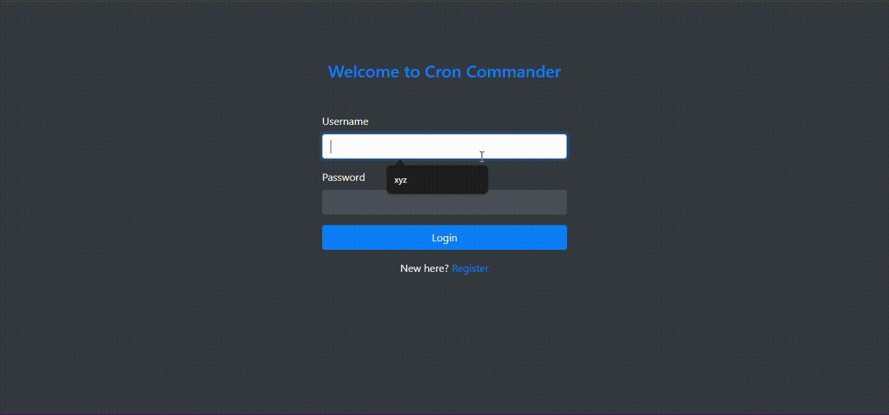

# Cron-Commander

## Overview

Cron-Commander is a web application built using Django that allows users to manage cron jobs on remote servers. Users can register, log in, and securely fetch cron jobs from their servers using SSH credentials.

## Demo


## Installation

### Requirements

- Python 3.x
- Django
- Paramiko (for SSH connections)
- Other dependencies listed in `requirements.txt`

### Setup Instructions

1. **Clone the repository:**

   ```
   git clone https://github.com/nirravv/Cron-Commander.git
   ```
   
2. **Setup virtual environment:**
    
    ```
    python -m venv env
    ```
3. **Activate the virtual environment:**
    ### On Windows (cmd):
    ```
   .\env\Scripts\activate
    ```
    
    ### On macOS/Linux (bash/zsh):
    ```
    source env/bin/activate
    ```

4. **Install dependencies:**
    ```
    pip install -r requirements.txt
    ```

### Configuration
1. **Database setup:**
    - Configure your database settings in settings.py.
    - Run migrations to set up your database schema:
        ```
        python manage.py migrate
        ```
2. **Static files setup:**
    - Collect static files for deployment:
        ```
        python manage.py collectstatic
        ```

### Usage
1. **Run the development server:**
    ```
    python manage.py runserver
    ```
    This will start the Django development server at http://127.0.0.1:8000/.
2. **Access the application:**
    Open your web browser and navigate to http://127.0.0.1:8000/ to access Cron-Commander.

### Features
- User Registration and Login:
    Users can register and log in securely.
- SSH Connection and Cron Job Management:
    Securely fetch and manage cron jobs on remote servers using SSH credentials.

### Contributing
If you'd like to contribute to Cron-Commander, please fork the repository and create a pull request. You can also open issues for bug reports or feature requests.

### License
This project is licensed under the MIT License - see the LICENSE file for details.

